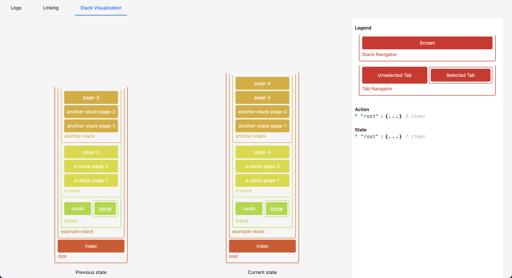
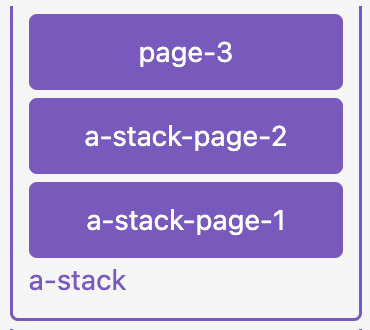
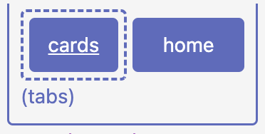
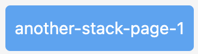

# @bam.tech/react-navigation-visualizer-dev-plugin

A Visualization Tool based on Expo DevTools Plugin for React Navigation.

## Installation

### Add the package to your project

```bash
npx expo install @bam.tech/react-navigation-visualizer-dev-plugin
```

## Usage

### Using with `react-navigation`

#### Integrate `react-navigation` with the DevTool hook

```jsx
import { useNavigationContainerRef } from '@react-navigation/native';
import { useReactNavigationDevTools } from '@bam.tech/react-navigation-visualizer-dev-plugin';

export default function App() {
  const navigationRef = useNavigationContainerRef();
  useReactNavigationDevTools(navigationRef);

  return <NavigationContainer ref={navigationRef}>{/* ... */}</NavigationContainer>;
}
```

### Using with `expo-router`

When using `expo-router`, integrate the DevTool in your main `_layout.tsx` file. You can import `useNavigationContainerRef` directly from `expo-router` and pass it to `useReactNavigationDevTools`:

```tsx
import { useNavigationContainerRef } from 'expo-router';
import { useReactNavigationDevTools } from '@bam.tech/react-navigation-visualizer-dev-plugin';

export default function RootLayout() {
  const navigationRef = useNavigationContainerRef();
  useReactNavigationDevTools(navigationRef);

  return <Stack />;
}
```

In this case, `expo-router` automatically manages the navigation container, so you just need to add the DevTool setup in your layout component.

## What to do with this plugin ?

### Launch in Metro

In the metro launcher, type Shift+M to open the dev tools menu, and select `@bam.tech/react-navigation-visualizer-dev-plugin`

The visualization tool is available under the `Navigation Tree` section



### What's in my stack ?

The idea of this plugin is to show your current navigation state, and its evolution during a user's journey through the app.

Three types of elements are represented :

- The stack navigators

  

- The tab navigators

  

- The screens

  

You can see the current and previous (last iteration) navigation states, and you can also collapse stacks if needed by clicking them.
